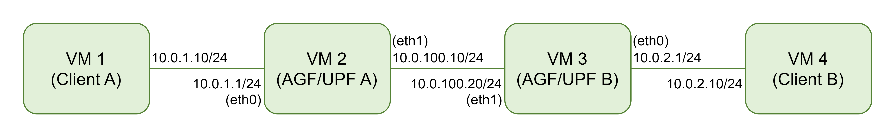

# xdpgtp: basic usage

The following example aims to provide new users insight on how to use this library.

## Environment

In this example, VM 2 of the following scenario will be configured to establish a GPT-U tunnel between VM 3 (UPF) and itself for VM 1 (client).

